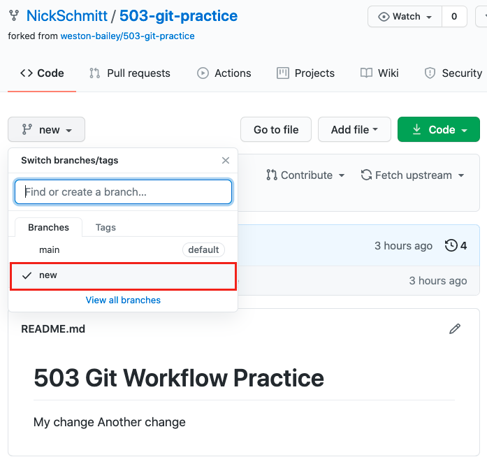
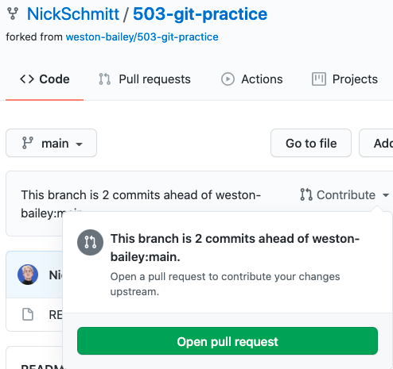
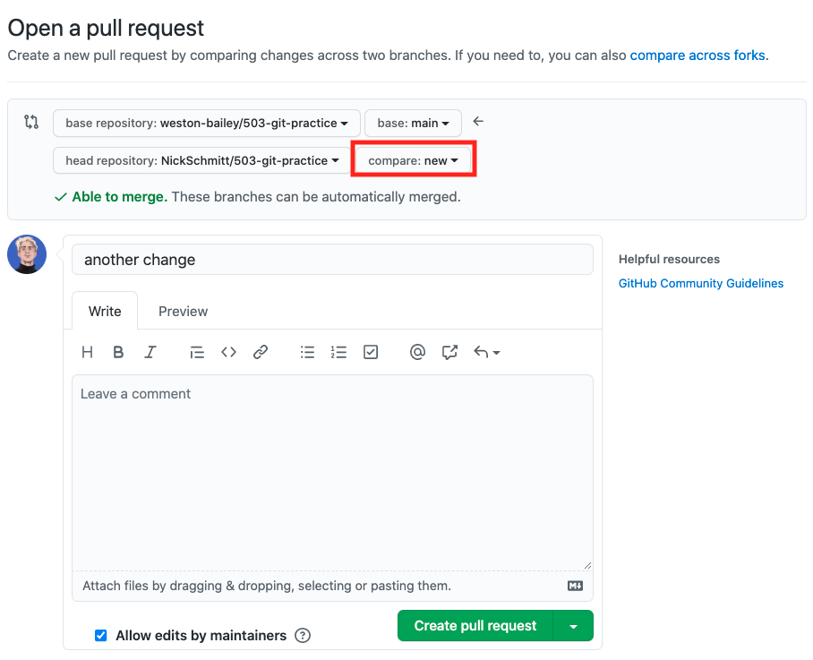

# Git Fork Workflow

### Setup:
1. [Git Manager creates repo on Github](#1-git-manager-creates-main-repository-on-github)
2. [Git Manager clones repo to local computer](#2-git-manager-clones-main-repository-to-local-computer)
3. [Teammates fork repo on Github](#3-teammates-fork-main-repository-on-github)
4. [Teammates clone their personal forked repo to local computer](#4-teammates-clone-their-forked-repo-to-local-computer)
5. [Teammates add remote upstream](#5-teammates-add-remote-upstream)

### Doing work:
**Note for Git Managers: you have no upstream, you only have origin, which is the main repo. This will be your teammates' upstream.**

1. [Pull work from upstream main to local main](#6-pull-work-from-upstream-to-local-main)
2. [Work on a topic branch](#7-use-a-topic-branch)
3. [Pull work from upstream to local main to check for updates](#8-pull-work-from-upstream-to-check-for-updates)
4. [Merge main to topic](#9-merge-main-to-topic-branch)
5.  [Push topic to remote origin topic](#10-push-topic-to-remote-origin-topic)
6.  [Submit pull request from topic to upstream](#11-submit-pull-request-from-topic-to-upstream)
7.  [Git Manager merges pull request into main repository]()
---
## Setup

### 1. Git Manager creates main repository on Github

[See Github docs for creating repositories](https://docs.github.com/en/github/getting-started-with-github/create-a-repo)


---
### 2. Git Manager clones main repository to local computer

* Git Manager makes their current local directory a git repository on the command line:
```
echo "# example" >> README.md
git init
git add README.md
git commit -m "first commit"
git branch -M main
git remote add origin <origin url>
git push -u origin main
```
---
### 3. Teammates fork main repository on Github

[See Github docs for forking repositories](https://docs.github.com/en/github/getting-started-with-github/fork-a-repo#fork-an-example-repository)

---
### 4. Teammates clone their forked repo to local computer

* Clone your repo, not the git manager's repo
* `<your-github-username>/<repo-name>` ✅
* `<git-managers-github-username>/<repo-name>` 🛑

[See Github docs for cloning repositories](https://docs.github.com/en/github/creating-cloning-and-archiving-repositories/cloning-a-repository#cloning-a-repository-using-the-command-line)

---
### 5. Teammates add remote upstream

* Here we are creating a link between your local repository and the git manager's remote repository, the main repository, to allow you to pull changes.
* On your main local branch:
`git remote add upstream https://github.com/<git-managers-github-username>/<repo-name>.git`
---
## Doing Work
### **Note for Git Managers: you have no upstream, you only have origin, which is the main repo. This will be your teammates' upstream.**
### 1. Pull work from upstream to local main
* Before you do work locally, and before you push work up to be merged, it's important to see if there are any updates from your collaborators. We do this by pulling work from our upstream remote repository down to our local repository:

`git pull upstream main`

* If there are merge conflicts, fix the merge conflicts then create a new commit.
---
### 2. Use a topic branch

* This is where we'll do our work. We can create a topic branch with `git branch <branch-name>`
* We can switch branches using `git checkout <branch-name>` or `git switch <branch-name>`
* We can stage and commit work there using `git add <file-name>` and `git commit -m <message>`
---
### 3. Pull work from upstream to check for updates

* Now that we've done work, we want to make sure it's compatible with the latest updates on the main repository.
* We switch to main with `git checkout main` or `git switch main`
* We pull any updates with `git pull upstream main`
---
### 4. Merge main to topic branch
* To merge updates into our topic branch, we first switch over to our topic branch with `git checkout <branch-name>`
* Then, we `git merge main` to merge and changes we pulled down from the main repository.
* We resolve any potential merge conflicts, then make another commit.
---
### 5. Push topic to remote origin topic
* Thanks to the last step, we have ensured that our latest local work is compatible with the latest version of the main repository (`upstream`).
* The next step is to push our topic work up to our personal remote repository (`origin`).
* `git push origin <branch-name>` ✅
* `git push origin main` 🛑
---
### 6. Submit pull request from topic to upstream

* After pushing to `origin/<branch-name>`, you will see updates on your Github repository in your topic branch.
* To view different branches on Github, click the following dropdown and select the topic branch.

* Next we will open a pull request by clicking `contribute` and `open pull request`

* Make sure the branches involved in the pull request are correct. In our workflow, we want `origin/new` going to `upstream/main`. On Github, that's `NickSchmitt/new` -> `weston-bailey/main`.

---
### 7. Git Manager merges pull request into main repository
Picture coming soon!